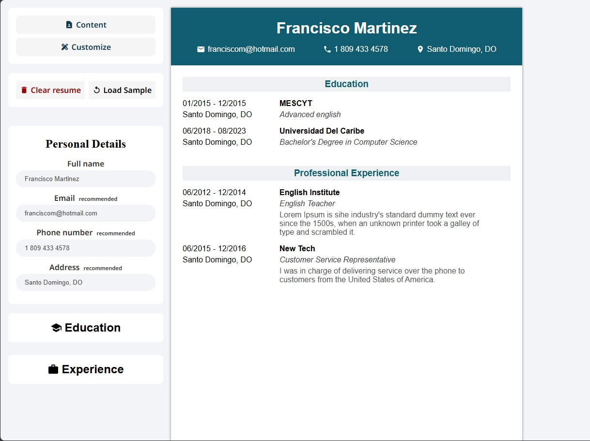

# CV-builder

See a live preview at: https://cv-builder-vercel.vercel.app/

<p>
  <a href="https://github.com/JosueDeLosSantos/CV-builder.git"></a>&nbsp;&nbsp;
  <a href="https://github.com/JosueDeLosSantos/CV-builder.git"></a>
</p>

This project is my first React application, designed to help users create professional CVs. It uses Vite as the module bundler for a fast and efficient development experience.

## Features

-   Create and customize your CV with ease
-   Real-time preview of your CV

## Installation

To get started with the project, follow these steps:

1. **Clone the repository:**

    ```bash
    git clone https://github.com/JosueDeLosSantos/CV-builder.git
    ```

2. **Install dependencies:**

    ```bash
    npm install
    ```

3. **Start the development server:**
    ```bash
    npm run dev
    ```

## Usage

1. Open your browser and navigate to `http://localhost:5173`.
2. Fill in your personal information, education, work experience, and skills.
3. Preview your CV in real-time.
